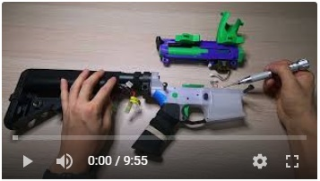
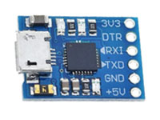
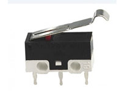
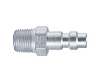
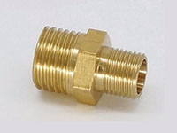
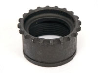

----

## License

本项目基于Creative Commons Attribution 4.0协议开源。

<a rel="license" href="http://creativecommons.org/licenses/by/4.0/"></a><br />This work is licensed under a <a rel="license" href="http://creativecommons.org/licenses/by/4.0/">Creative Commons Attribution 4.0 International License</a>.

----

# VR15: a VR FPS game controller that generate haptic feedback with high pressure air.


## <font color="#dd0000">Disclaimer</font>

**This is a VR game controller, a variation of airsoft, not a firearm. It DOES NOT have the ability to shoot any projectile (not even BBs). Although it shares a similar appearance to an AR, it is derived from airsoft, and is NOT compatible with a firearm. The internal is re-designed to accommodate electronic and pneumatic components to generate reoil feedback only. Since it is driven by high pressure air, please make sure components and their assembly are secured. Replicating and using this design is at your own risk. Please follow your local laws.**

**Disconnect the air source and the power before you disassemble the controller!**

## Features

- The haptic feedback is provided by controlled high pressure air.

  

- The displacement of the charging handle is being tracked (trigger motion, semi-auto motion, and the magazine is also being tracked).

  

- Simulate AR's hold open.

  

- **Check out the video on Youtube:**

  [](https://youtu.be/NAWumtR1TvY "Introduction")

## 设计思路

- A GBB（gas blow back）airsoft uses a mechanical structure to release CO2 or propane to propel BBs and the bolt, which generates reoil feedback. An HPA（high pressure air）uses a solenoid valve to control the high pressure air, but usually does not have the bolt design for the sake of power efficiency. For a VR/AR game controller, being able to shoot BBs is not necessary, even harmful. Removing this function can improve the safety while playing the game, as well as improve the generated recoil feedback.
- For the above-mentioned reason, the whole structure can be re-designed (reversed): The gas input coming from the front, pointing directly toward the stock. The solenoid valve can occupy part of the magazine space, then be connected to the cylinder. It is possible to mount the air tank inside of the handguard, if choosing the right size of the air tank.
- Main design purpose: trying to simulate the interaction with an AR as much as possible for a VR scenario.
    - The position tracking of the magazine is done by the VR system (e.g., Oculus Rift). Whether the magazine is well inserted is detected by a microswitch.
    - The displacement of the charging handle is detected by a ToF (time of flight) sensor. Since the handle and the bolt are not always moving together. Whether the bolt is in hold open state is detected by using a Hall sensor.
    - After emptying the magazine,  the bolt catch is driven by an electromagnet to stop the bolt halfway.
    - Safe/fire is achieved by physical design. Pulling the trigger is detected by a microswitch. Semi/auto mode selection is detected by another microswitch.
    - The forward assist is left empty yet. It is possible to install a joystick for interaction.

## Implementation

**There are two parts: **

- The hardware design, which is provided in this repository.

- The game that customized for this hardware (as shown in the video/gif). There is a demo made by Unity. You can find it [here](https://github.com/zhyma/rush_b).

## Hardward BOM
### Off-the-shelf parts
- Electronic parts

    | Item | PCS | Ref img | Notes    |
    | --- | --- | ---| ---|
    |Electromagnet|1||12V，push-and-pull type. The metal frame size is 21x10x11mm, fixing by two M2 screw.|
    |MP1584 DC-DC step down|1|||
    |ESP32 (WROOM)|1|||
    |USB to TTL|1||USB to TTL|
    |GY6180/VL6180X sensor|1||Be aware of the dimensions (There are two sizes, get the smaller one).|
    |Hall sensor|1||Module that output on/off signal (with an amplifier on the board).|
    |Microswith KW10-Z3P|4|||
    |NMOS SI2302|2||package: SOT-23. I think 2N7002 also works.|
    |Diode 1N4007|2||package: SMD (2010?) |
    |SMD resistors|N||package：0603. You will need several different value.|

- Pneumatic parts（Using Foster 22-2 and NPT 1/8 as an example. You can choose other pneumatic connnectors）

    | Item | PCS | Ref img | Notes    |
    | --- | --- | ---| ---|
    |Solenoid valve：MAC 35A-AAA-DDBA-1BA|1||Be aware of the port (NPT or BSPP)<br />You will need to modify its' shell.|
    |Cylinder: MAL16x75|1||You will need to cut one end off.|
    |Cylinder: MAL16x25|1||You only need the piston with the guiding rod. You can leave rest of the parts as back up.|
    |Foster 22-2 1/8 male NPT x 1/8|1||Depending on your air tank output connector.|
    |1/8 NPT female to 1/8 NPT male|1+||Being used to extend the Foster connector. |
    |1/8 NPT male M5x0.8 male|1||Connect the valve and the cylinder|
    |Air tank (with hose)|1||I'm using a HPA air tank for airsoft. The output pressure is set to 100psi.|

- Mechanical parts

    | 部件 | 数量 | 参考图片 | 备注    |
    | --- | --- | ---| ---|
    |21 pieces spring and pin set|1||I thnk the 32 pieces one contains the magazine release and trigger guard.|
    |Trigger guard|1||You can either buy one or 3D print one (like [this](https://www.thingiverse.com/thing:2479358))|
    |Magazine release|1|||
    |Charging handle|1| |The length is rougly 17mm. Be aware of the size.|
    |Buffer and stock set|1||Buffer, buffer tube, buffer spring, , castle nut, endplate.<br />Stock (I think mk18 navy has plenty of room for batteries).|
    |Pistol grip|1||The one used for GBB, not AEG|
    |Delta ring|1||Not necessary. Or you can [print it](https://www.thingiverse.com/thing:4008338).|

- Standard parts

    | Item                        | PCS        | Notes                                         |
    | --------------------------- | ---------- | --------------------------------------------- |
    | M5-0.8x5mm headless screw | 1          | Seal the input/output of the cylinder. |
    | M2x15 尼龙内六角螺丝       | N |You may need to trim some of those short. |
    | M3x6 screw                   | 1          | Fix the GY6180. |
    | M3x8 screw                   | 1          | Fix the two-piece upper. |
    |M6x20mm screw, washer and nut.|1|Fix the grip.|
    |M2.5x16mm screw.|1|Fix the bolt catch.|
    |4mm x 2mm disc magnet|1|Detecting the bolt catch motion.|

    


### 3D printed parts 1
| Item             | PCS | Ref img | Notes |
| ---------------- | --- | ------- | ----- |
| Lower        | 1   |  | vr15_lower.STL |
| Upper - left | 1   |  | vr15_upper_l.STL |
| Upper - right | 1   |  | vr15_upper_r.STL |
| Trigger box | 1   |  | trigger_box.STL |
| Trigger   | 1   |  | trigger.STL |
| Semi-auto selector | 1   |  | selector.STL |
| Magazine | 1   |  | mag.STL (only a placeholder)<br />accessory/oculus_mount/quest_mag_mount.stl: mount Rift/Quest 2 left controller<br />quest_mag_mount_l.stl and quest_mag_mount_r.stl are two-pieces version. |
| Piston spacer | 1   |  | piston_weight_placeholder.STL<br />You can redesign it (e.g. with copper) to add some weight to enhance the feedback. |
| Piston end | 1   |  | bolt_plug.STL<br />You can use nuts come with your cylinder. |
| Bolt | 1    |  | boltcarrier.STL<br />The original design is to use copper to add weight. |
| Bolt catch | 1    |  | boltcarrier.STL<br />You may need to file it or trim it to make sure it moves smoothly. |
| Charging handle block | 1 |  | charging_handle_block.STL<br />You may need to redesign it to make sure the front of the charging handle is flat. |
| Wire cover | 1 |  | lower_wire_cover.STL |
| ToF sensor spacer | 1 |  | tof_spacer.STL |

### 3D printed parts 2

| Item           | PCS  | Ref img                           | Notes                                                        |
| -------------- | ---- | --------------------------------- | ------------------------------------------------------------ |
| delta ring nut | 1    |  | hex_ring.stl<br />You can use a delta ring to fix the front of the upper. |
| Buffer spacer  | 1    |   | buffer_spacer.STL<br />Make sure your piston move out of the cylinder (IMPORTANT!) |
| PCB mount      | 1    |       | pcb_grip_mount.STL                                           |
| Quest mount    | 1    |     | You will need  other files from [Thingiverse](https://www.thingiverse.com/thing:3515707)<br />quick_release_picatinny_rail_mount_grip_short<br />quick_release_picatinny_rail_mount_hub<br />quick_release_picatinny_rail_mount_lever_right<br />Mount Rift/Quest 2 right controller. |
| 1/8 NPT plug   | 1    |     | 1_8_npt_plug.STL                                             |
| 1/8 NPT plug   | 2    |     | 1_8_npt_side_block.STL                                       |

## Modify the off-the-shelf parts

### Solenoid valve：
- Use the provided model "1/8 NPT plug" to protect input/output. Remove the protruding part of the No.3. 

- File the corner so the solenoid can be installed into the upper.

- Modify the wire (You can use a JST-XH 2-pin connector.).

  

### 气缸改造：
- Remove the cap of both end.

  

  

- The cap with the rod going through will not be used. For the other one, cut to remove the through hole. Drill, then tap with M5x0.8. After this modification, the input/output will be located at the top of the cap. Tight the cap back to the cylinder (don't forget your O-ring).

  

- Now there is one end of the cylinder is left open. Cut near that end to remove the thread, file it to make sure the cut is round and smooth.

- install the piston spacer (it serves as a linear bearing). Using a nut to tight it up. Then install the rod end.

  

  

- Grease the piston and the spacer.

- Install the Foster connector, solenoid valve, and the cylinder. (The 1/8 NPT male to female connector is used to make sure that you can easily connect/disconnect your air source.)

  

- Use thread seal tape and headless screw to seal the original input/output in the cylinder.

- Mount the bolt to the rod end. You can use some glue.

  

### Microswitches：
- You need to modify one of them (for semi-auto selector) a little bit (maybe add a piece of plastic underneath the handle)
  
  
- The switch for magazine detection will be installed this way.

  

  

  

  

### Modify the charging handle
- Glue the charging handle block to the front to make sure the surface toward the TOF sensor is flat.

- You will need to file the L shape end to make sure it can slide into the upper.

  

- 

    

## Assembly

### Upper

- Install the TOF sensor. Make sure its' direction is parallel to the handle's movement (you can use the TOF spacer and cut some rubber plate)

  

  

- Install the charging handle and pneumatic parts.

- Make sure your wiring is secured.

  

- The two pieces can be fixed by using screws (3xM2 to the top and )

### Trigger box
- Install the microswitch for mag detection (with two M2 screws).

- Install the microswitches for firing and semi-auto (with two M2 screws).

- Install the electromagnet (with two M2 screws).

- Install the Hall sensor (you can use some hot glue). You adjust the position of the Hall sensor for later steps.

  

- Install the trigger and its' spring.

- Connect the wires.


### 下机匣
- Install the trigger guards, take-down pins, selector pin, buffer pin, buffer tube to the lower.

- Install the trigger box. fix it with the pin and the magazine release.

  

- Secure your wires. install the pistol grip (do not tight the screw yet).

- Install the selector (be careful of the little metal handles of the microswitches! )
  Now you can tight the screw.

  

- Use epoxy to glue the disc magnet to the bolt catch. Be aware of the polarity. The hall sensor is only sensitive toward one direction.

  

- Install the bolt catch (with an M2.5 screw). You may need to file or trim it to make sure:

  - There is no friction between it and the lower (the electromagnet can move it easily).
  - It moves freely when upper is installed.
  - It can hold the bolt (the corner that makes contact with the bolt is not so round).
  - It can release the bolt once you press it (the corner that makes contact the bolt is smooth).

  

- This is how bolt catch works:


## PCB

- You can find the schematic, PCB design and Gerber files in the source file.
  

- Some soldering. (Move the components from the DC-DC module to the PCB.)
  The PCB was updated after I made this prototype, but not tested yet. I made a mistake of using the pins  that being connected to the interal flash as GPIO.

  

  

- The pin out is shown below.

  

- There is a model to mount your PCB inside the pistol grip. Wires are TTL (TXD, RXD, GND) and power (11.1V Li-Po)

  

  

### Assemble the upper and the lower
- Connect the connectors (ToF sensor and the solenoid valve)

- Place the upper and the lower in place and fix them with the front and rear take-down pins.

  

  

  

## Firmware
- Flash the firmware:

  - Turn the swith to "flash" (IO 0 is connected to the GND).
  - Connect TXD to RXD of the USB-TTL board, RXD to TXD, and GND to GND.

- Use I2C to read VL6180Xdata (Arduino's default setting for ESP32)

  - White/IO 22: SCL
  - Green/IO 21: SDA

  

### Arduino Configuration

- Install VL6180X package (by Pololu，version1.3.0)
- Configure for ESP32
    - Add the address：https://raw.githubusercontent.com/espressif/arduino-esp32/gh-pages/package_esp32_index.json
    - The version I'm using：esp32 by Espressif Systems，version 1.0.4
    - Choose your board：WEMOS LOLIN32 (I only lower the upload speed. I don't think it is necessary.)
        ```
        Upload speed: 115200
        CPU frequency: 240MHz(Wifi/BT)
        Flash frequency: 80MHz
        Partition Scheme: Default
        ```

## Communication protocol
### ESP32 to Unity
- 5 byts，example:

  |1|2|3|4|5|
  |---|---|---|---|---|
  |0xFA|ToF H|ToF L|Switches' states|0xAF|

- Start：0xFA；end：0xAF

- The 2nd, 3rd byte：ToF data

- The 4th byte：the 5th bit is used to report the solenoid operation is done (from turning on to turning off). The last four bits are used to represent the states of microswitches. 

  |7|6|5|4|3|2|1|0|
  |---|---|---|---|---|---|---|---|
  |x|x|x|Operating is done<br />"1" is "done".|Hold open<br />"1" is closed.<br />"0" is open.|Magazine inserted<br />"1" is no mag. <br />"0" is mag inserted.|Trigger<br />"1" is trigger pulled<br />"0" is not being pulled.|Semi-auto<br />"1" is auto. <br />"0" is semi.|
  
  
### Unity to ESP32
- 1 byte. The first 4 bits is used to controll the time of turning on the solenoid. The latter 4 bits is  used to decide how long it takes to turn off the electromagnet after turned the solenoid off.
  - Solenoid being turned on for 0~150ms. Step size: 10ms. The command is 0x0~0xF.
  - Electromagnet delay is 10~150ms. Step size: 10ms. The command is 0x1~0xF. The command 0x0 will not turn on the electromagnet at all.
  - Example: 
    - 0x20 will turn on the solenoid for 20ms, electromagnet will not be turned on. 
    - 0x2A will turn on the solenoid for 20ms, electromagnet for 120ms (20ms plus 100ms delay).

## Acknowledgment

Big thanks to Tomi, 老吴, Eric, and 检察长！

## Early prototype (with circuit inside of the lower)


